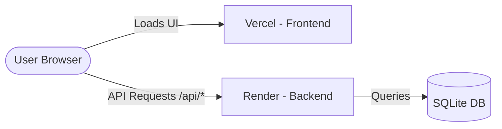

# 🚀 Cura Deployment Guide (Free, High Efficiency)

This guide walks you through deploying the **Cura Personalized Healthcare Recommendation System** for free, using modern cloud platforms with Git integration (continuous integration/continuous deployment).

---

## 🏗️ Deployment Architecture



* **Frontend**: Hosted on **Vercel** (Free, global CDN, automated deployments).
* **Backend**: Hosted on **Render** (Free web service tier for Python runtimes).
* **Database**: **SQLite** (stored on Render's local disk).
  * *Note: Render's free tier disks are ephemeral. If the service restarts, the SQLite DB will reload to its default seeded state (admin123, analyst123, user123). For persistent production data, update `backend/database.py` to use a free **Supabase** PostgreSQL URI.*

---

## 📦 Prerequisites

1. A **GitHub** account.
2. Push your project folder to a GitHub repository:
   ```bash
   git init
   git add .
   git commit -m "Initial commit for deployment"
   # Create a repository on GitHub, then link and push:
   git remote add origin https://github.com/YOUR_USERNAME/YOUR_REPO_NAME.git
   git branch -M main
   git push -u origin main
   ```

---

## 🐍 Step 1: Deploy Backend (Render)

Render is a cloud platform that hosts Python apps for free.

1. **Sign up / Log in** to [Render](https://render.com/).
2. Click **New +** -> **Web Service**.
3. Connect your GitHub account and select your repository.
4. Configure the Web Service settings:
   * **Name**: `cura-backend` (or a name of your choice).
   * **Language**: `Python`.
   * **Branch**: `main`.
   * **Root Directory**: `.` (the root).
   * **Build Command**: 
     ```bash
     pip install -r backend/requirements.txt
     ```
   * **Start Command**:
     ```bash
     python -m uvicorn backend.main:app --host 0.0.0.0 --port $PORT
     ```
   * **Instance Type**: Select **Free**.
5. Click **Advanced** and add the following **Environment Variables**:
   * `PYTHONPATH` = `.`
   * `JWT_SECRET_KEY` = `your_super_secret_jwt_key_here` (change this to a secure random string).
6. Click **Create Web Service**. 
7. Once successfully deployed, Render will provide a public URL (e.g. `https://cura-backend.onrender.com`). **Copy this URL.**

---

## ⚛️ Step 2: Configure & Deploy Frontend (Vercel)

Before deploying the frontend, we must configure Vercel to route API requests starting with `/api` directly to your Render backend URL.

### 1. Create a `vercel.json` file in the `frontend` folder
Create [frontend/vercel.json](file:///Users/trushargpatel/Downloads/Internship/Health%20Recom/frontend/vercel.json) to handle URL rewriting. This replaces the Vite local dev proxy config in production:

```json
{
  "rewrites": [
    {
      "source": "/api/:path*",
      "destination": "https://YOUR-RENDER-BACKEND-URL.onrender.com/api/:path*"
    },
    {
      "source": "/(.*)",
      "destination": "/index.html"
    }
  ]
}
```
*(Replace `https://YOUR-RENDER-BACKEND-URL.onrender.com` with your actual Render URL copied from Step 1).*

### 2. Deploy on Vercel
1. Go to [Vercel](https://vercel.com/) and log in with GitHub.
2. Click **Add New** -> **Project**.
3. Select your repository.
4. Configure the Project:
   * **Framework Preset**: `Vite`.
   * **Root Directory**: `frontend`.
   * **Build Command**: `npm run build` (default).
   * **Output Directory**: `dist` (default).
5. Click **Deploy**.
6. Within a few seconds, Vercel will build and host your frontend globally. You will get a live URL (e.g., `https://cura-app.vercel.app`).

---

## 🧪 Step 3: Test the Live App

1. Visit your Vercel URL.
2. Go to the public signup form and register a new user.
3. Log in with the default accounts or the new user you just created.
4. Run a symptom prediction and check that the **Recommendation engine** and **Knowledge Graph** render data successfully.

---

## 💡 Pro-Tips for Free-Tier Deployment

* **Render Cold Start**: Render's free tier spins down web services after 15 minutes of inactivity. The first API request after a sleep period might take 30-50 seconds to boot up. To prevent this, you can use a free pinging service (like [UptimeRobot](https://uptimerobot.com/)) to ping your backend `/api/auth/me` endpoint every 10 minutes to keep it awake.
* **Persistent Database**: Since SQLite writes locally, any new user signups or log records will be wiped out when Render restarts your instance (at least once a day). To make it persistent for free:
  1. Spin up a free PostgreSQL database on [Supabase](https://supabase.com/).
  2. Copy the Connection URI.
  3. Set a Render Environment Variable `DATABASE_URL` pointing to your Supabase PostgreSQL database.
  4. Modify `backend/database.py` to read `DATABASE_URL` from variables if it exists.
