# 📋 Personalized Healthcare Recommendation System
## Project Documentation & Work Timeline

---

## 1. Project Overview

| Field | Details |
|-------|---------|
| **Project Name** | Personalized Healthcare Recommendation System |
| **Domain** | Healthcare + Data Science + Machine Learning |
| **Objective** | Build an intelligent system that recommends diseases, doctors, medications, diet, and exercises based on user symptoms, preferences, and behavior patterns |
| **Current Phase** | Phase 1 — Data Science Pipeline (this document) |
| **Future Phase** | Phase 2 — Web Application (JWT Auth, API, Dashboard) |

### What Does This System Do?

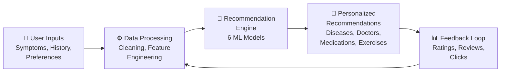

A user enters their symptoms → the system predicts possible diseases → recommends appropriate doctors, medications, diet, and exercises → learns from user feedback to improve over time.

---

## 2. Technology Stack — What We Use & Why

### 2.1 Core Libraries

| Library | Version | What It Does | Why We Use It |
|---------|---------|-------------|---------------|
| **Python** | 3.10+ | Programming language | Industry standard for data science & ML |
| **pandas** | 2.x | Data manipulation & analysis | Fast DataFrame operations, CSV handling, merging datasets |
| **numpy** | 1.x | Numerical computing | Array operations, mathematical functions, matrix math |
| **matplotlib** | 3.x | Static plotting | Publication-quality charts, full customization control |
| **seaborn** | 0.13+ | Statistical visualization | Beautiful default styles, built on matplotlib, great for heatmaps |
| **plotly** | 5.x | Interactive visualization | Zoomable, hoverable charts; excellent for dashboards |

### 2.2 Machine Learning Libraries

| Library | What It Does | Where We Use It |
|---------|-------------|----------------|
| **scikit-learn** | Classical ML algorithms, preprocessing, metrics | TF-IDF vectorization, cosine similarity, scaling, encoding, train/test split, evaluation metrics |
| **scikit-surprise** | Recommendation-specific algorithms | Collaborative filtering (SVD, SVD++, KNN-based), cross-validation for recommender systems |
| **TensorFlow/Keras** | Deep learning framework | Neural Collaborative Filtering, embedding layers for user-item interactions |
| **NetworkX** | Graph data structures & algorithms | Knowledge graph construction (User↔Disease↔Symptom↔Treatment), graph-based recommendations |

### 2.3 NLP & Text Processing

| Library | What It Does | Where We Use It |
|---------|-------------|----------------|
| **NLTK** | Natural language toolkit | Tokenization, stopword removal, lemmatization of medical reviews |
| **TextBlob** | Simple NLP API | Sentiment analysis of user reviews (polarity & subjectivity scores) |
| **WordCloud** | Word cloud generation | Visualizing common terms in disease descriptions and reviews |

### 2.4 Other Tools

| Tool | Purpose |
|------|---------|
| **Jupyter Notebook** | Interactive development environment for step-by-step data analysis |
| **scipy** | Statistical tests (t-tests, chi-square) for significance testing |
| **joblib / pickle** | Saving trained models to disk for reuse |

---

## 3. Data Sources — Where Our Data Comes From

### 3.1 Kaggle Datasets (Public & Free)

We collect data from **Kaggle** (https://www.kaggle.com), the world's largest data science community with free, open-source datasets.

| # | Dataset | Kaggle Source | Records | Key Columns | How We Use It |
|---|---------|--------------|---------|-------------|---------------|
| 1 | **Symptom-Disease Mapping** | [Disease Prediction Dataset](https://www.kaggle.com/datasets/ebrahimelgazar/doctors-specialist-recommendation-system) | ~5,000+ rows | `Disease`, `Symptom_1` to `Symptom_17` | Maps symptoms to diseases — backbone of content-based filtering |
| 2 | **Disease Descriptions** | Same Kaggle source | ~40 diseases | `Disease`, `Description` | Text data for TF-IDF vectorization and NLP |
| 3 | **Disease Precautions** | Same Kaggle source | ~40 diseases | `Disease`, `Precaution_1` to `Precaution_4` | Precautionary recommendations |
| 4 | **Medications & Treatments** | [Medicine Recommendation Dataset](https://www.kaggle.com/datasets/noriuk/medicine-recommendation-system-dataset) | ~40 diseases | `Disease`, `Medication`, `Diet`, `Exercise` | Treatment, diet, exercise recommendations |

### 3.2 Synthetic Data (Generated by Us)

Since real patient interaction data is protected by HIPAA regulations, we **programmatically generate** realistic synthetic data:

| Data | How We Generate It | Fields |
|------|--------------------|--------|
| **User Profiles** | Python `random` + `faker` library | `user_id`, `age`, `gender`, `location`, `chronic_conditions` |
| **User Interactions** | Simulated browsing/search behavior | `search_query`, `clicked_disease`, `consultation_booked`, `timestamp` |
| **Ratings** | Random ratings weighted by disease relevance | `user_id`, `disease_id`, `rating` (1-5) |
| **Reviews** | Template-based text generation | `user_id`, `disease_id`, `review_text`, `timestamp` |

> [!NOTE]
> **Why synthetic data?** Real healthcare data requires HIPAA compliance, IRB approval, and data use agreements. Synthetic data lets us build and validate the entire pipeline. The system architecture remains identical — just swap in real data later.

### 3.3 Data Flow Diagram

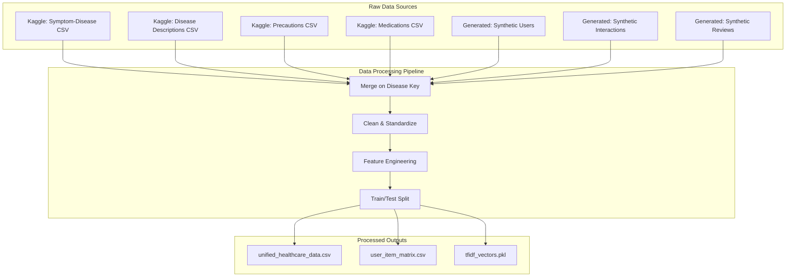

---

## 4. How Things Work — Algorithm Explanations

### 4.1 Content-Based Filtering

**Concept:** "If you liked Disease X's treatment, you'll like similar treatments."

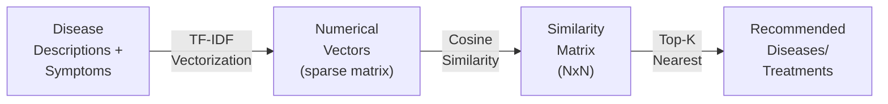

**How it works step by step:**

1. **TF-IDF Vectorization** — Converts disease descriptions (text) into numerical vectors
   - **TF** (Term Frequency): How often a word appears in a document
   - **IDF** (Inverse Document Frequency): How unique a word is across all documents
   - Formula: $\text{TF-IDF}(t,d) = \text{TF}(t,d) \times \log\frac{N}{\text{DF}(t)}$
   
2. **Cosine Similarity** — Measures angle between two vectors (0 = no similarity, 1 = identical)
   - Formula: $\cos(\theta) = \frac{A \cdot B}{\|A\| \times \|B\|}$
   
3. **Recommendation** — For a given disease, find top-K most similar diseases

**Source code (from mentor's instructions):**
```python
from sklearn.feature_extraction.text import TfidfVectorizer
from sklearn.metrics.pairwise import cosine_similarity

vectorizer = TfidfVectorizer()
item_vectors = vectorizer.fit_transform(disease_descriptions)
cosine_sim = cosine_similarity(item_vectors)

def recommend_items(item_id, num_recommendations=3):
    sim_scores = list(enumerate(cosine_sim[item_id]))
    sim_scores = sorted(sim_scores, key=lambda x: x[1], reverse=True)
    return sim_scores[1:num_recommendations+1]  # exclude self
```

---

### 4.2 Collaborative Filtering

**Concept:** "Users who are similar to you liked these items."

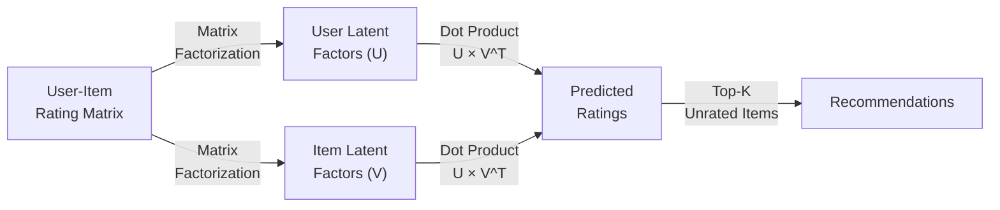

**How it works:**

1. **User-Item Matrix** — Rows = users, Columns = items (diseases/treatments), Values = ratings
2. **SVD (Singular Value Decomposition)** — Decomposes the sparse matrix into latent factors
   - Discovers hidden patterns: "users who search for heart-related symptoms also look at diet plans"
3. **Prediction** — Multiply latent factors to predict missing ratings

**Why SVD?** Healthcare interaction matrices are very **sparse** (users interact with few diseases). SVD handles sparsity well and discovers latent relationships.

**Source code:**
```python
from surprise import Dataset, Reader, SVD
from surprise.model_selection import cross_validate

reader = Reader(rating_scale=(1, 5))
data = Dataset.load_from_df(ratings_df[['user_id', 'item_id', 'rating']], reader)
model = SVD(n_factors=50, n_epochs=20, lr_all=0.005, reg_all=0.02)
cross_validate(model, data, measures=['RMSE', 'MAE'], cv=5)
```

---

### 4.3 Hybrid Filtering

**Concept:** "Combine the strengths of both content-based and collaborative filtering."

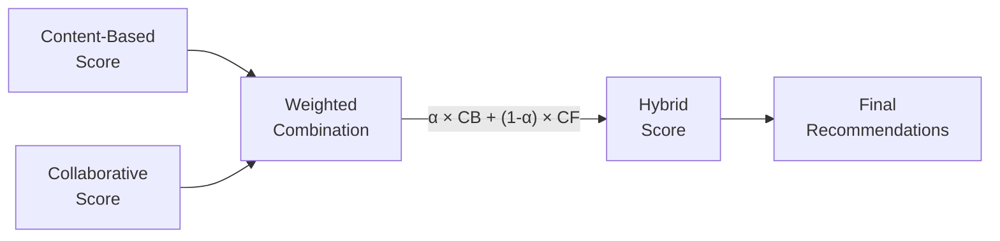

**How it works:**
```python
def hybrid_recommendation(user_id, item_id, alpha=0.5):
    content_score = get_content_similarity(item_id)     # From TF-IDF
    collab_score = get_collaborative_prediction(user_id, item_id)  # From SVD
    hybrid_score = alpha * content_score + (1 - alpha) * collab_score
    return hybrid_score
```

**Why hybrid?**
- Content-based works for **new items** (no ratings needed) — solves the **cold start** problem
- Collaborative works for **established users** with history
- Hybrid gets the **best of both worlds**

---

### 4.4 Context-Aware Recommendations

**Concept:** "Adjust recommendations based on when, where, and what's trending."

| Context Signal | How We Use It | Example |
|---------------|--------------|---------|
| **Time/Season** | Weight diseases by seasonal prevalence | Flu recommendations increase in winter |
| **Location** | Regional disease patterns | Dengue recommendations in tropical regions |
| **Trends** | Rolling average of recent searches | If many users search "COVID symptoms", boost related recommendations |
| **Recency** | Time-decay weighting | Recent interactions matter more than old ones |

---

### 4.5 Sentiment Analysis

**Concept:** "Analyze user reviews to understand satisfaction and improve recommendations."

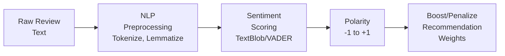

**Example:**
- Review: *"The medication worked great, felt better in 2 days"* → Polarity: **+0.8** → **Boost** this treatment's recommendation score
- Review: *"Terrible side effects, would not recommend"* → Polarity: **-0.7** → **Reduce** this treatment's recommendation score

---

### 4.6 Deep Learning Model (Neural Collaborative Filtering)

**Concept:** "Use neural networks to learn complex, non-linear user-item interaction patterns."

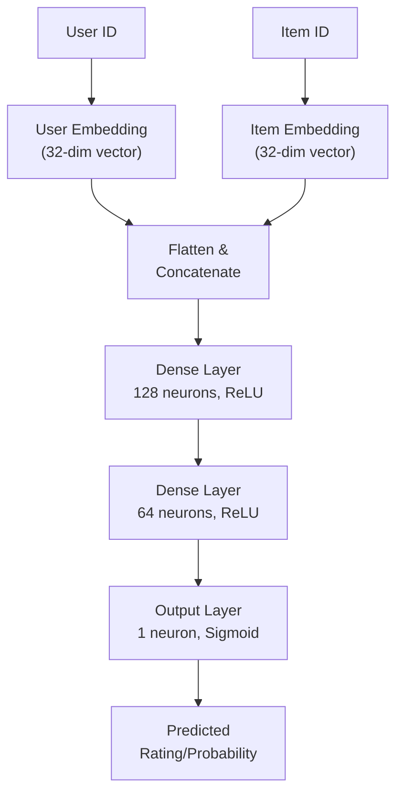

**How it works:**
1. **Embedding Layers** — Convert user/item IDs into dense vector representations (like word2vec but for users and items)
2. **Dense Layers** — Learn non-linear combinations of user and item features
3. **Output** — Predicts the probability that a user will interact positively with an item

**Why deep learning?** Traditional methods (SVD) assume linear relationships. Neural networks capture **non-linear patterns** like: "Young users in urban areas with tech jobs prefer telemedicine consultations."

---

### 4.7 Graph-Based Recommendation

**Concept:** "Model healthcare as a knowledge graph and traverse it for recommendations."

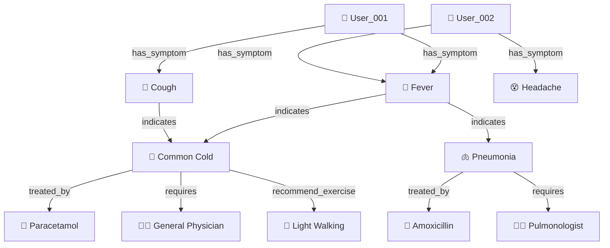

**How it works:**
1. **Build graph** — Nodes = Users, Symptoms, Diseases, Treatments, Doctors; Edges = relationships
2. **Traverse** — Find paths: User → Symptoms → Diseases → Treatments
3. **Similarity** — Users sharing many symptom nodes get similar recommendations
4. **Discovery** — Graph reveals connections not obvious in tabular data

---

### 4.8 Reinforcement Learning

**Concept:** "The system learns from real-time user interactions, like a doctor gaining experience."

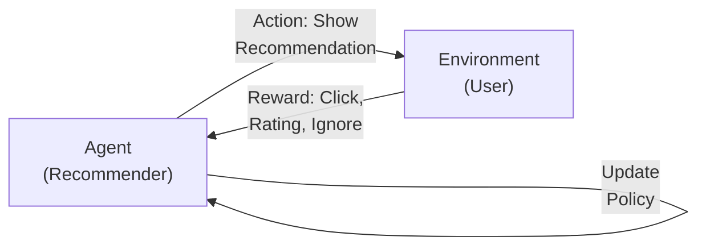

**Algorithm: Multi-Armed Bandit (Epsilon-Greedy)**
- Each recommendation is an "arm" to pull
- **Exploit**: Show the best-performing recommendation (highest reward so far)
- **Explore**: Occasionally show new recommendations to discover better options
- Balance exploration vs exploitation to maximize long-term user satisfaction

---

## 5. Data Science Workflow

Our workflow follows the **CRISP-DM** (Cross-Industry Standard Process for Data Mining) methodology:

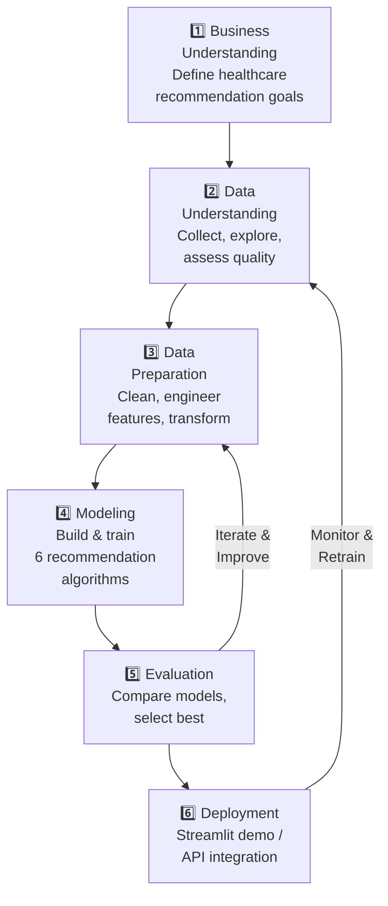

---

## 6. Work Timeline — Day-by-Day Breakdown

### Week 1: Data Foundation & Exploration

| Day | Date | Tasks | Deliverables | Status |
|-----|------|-------|-------------|--------|
| **Day 1** | Jun 24 (Tue) | Project setup, install dependencies, download datasets from Kaggle, generate synthetic user data | `requirements.txt`, `data/raw/` populated, synthetic data scripts | ⬜ |
| **Day 2** | Jun 25 (Wed) | Data loading, merging all datasets, initial inspection, data quality report | `01_data_collection_and_loading.ipynb`, `unified_healthcare_data.csv` | ⬜ |
| **Day 3** | Jun 26 (Thu) | Full EDA — univariate analysis, distributions, missing value heatmaps, disease frequency plots | `02_exploratory_data_analysis.ipynb` (Part 1) | ⬜ |
| **Day 4** | Jun 27 (Fri) | Full EDA — bivariate analysis, correlation heatmaps, word clouds, temporal trends, text analysis | `02_exploratory_data_analysis.ipynb` (Part 2) | ⬜ |
| **Day 5** | Jun 28 (Sat) | Data cleaning, missing value imputation, standardization, encoding | `03_data_preprocessing.ipynb` (Part 1) | ⬜ |
| **Day 6** | Jun 29 (Sun) | Feature engineering — severity scores, risk scores, TF-IDF vectors, user-item matrix | `03_data_preprocessing.ipynb` (Part 2), `user_item_matrix.csv` | ⬜ |

### Week 2: Model Building & Evaluation

| Day | Date | Tasks | Deliverables | Status |
|-----|------|-------|-------------|--------|
| **Day 7** | Jun 30 (Mon) | Content-Based Filtering — TF-IDF + Cosine Similarity, evaluate Precision@K | `04_content_based_filtering.ipynb` | ⬜ |
| **Day 8** | Jul 1 (Tue) | Collaborative Filtering — SVD, KNN, NMF, cross-validate with RMSE/MAE | `05_collaborative_filtering.ipynb` | ⬜ |
| **Day 9** | Jul 2 (Wed) | Hybrid Filtering + Context-Aware Recommendations | `06_hybrid_filtering.ipynb`, `07_context_aware.ipynb` | ⬜ |
| **Day 10** | Jul 3 (Thu) | Sentiment Analysis — NLP preprocessing, TextBlob scoring, sentiment-enhanced weights | `08_sentiment_analysis.ipynb` | ⬜ |
| **Day 11** | Jul 4 (Fri) | Deep Learning — Neural Collaborative Filtering with TensorFlow/Keras | `09_deep_learning_model.ipynb` | ⬜ |
| **Day 12** | Jul 5 (Sat) | Graph-Based Recommendation (NetworkX) + Reinforcement Learning (MAB) | `10_graph_based.ipynb`, `11_reinforcement_learning.ipynb` | ⬜ |
| **Day 13** | Jul 6 (Sun) | Model comparison, evaluation dashboard, final report, documentation cleanup | `12_model_evaluation_comparison.ipynb`, `model_comparison_report.md` | ⬜ |

### Gantt Chart

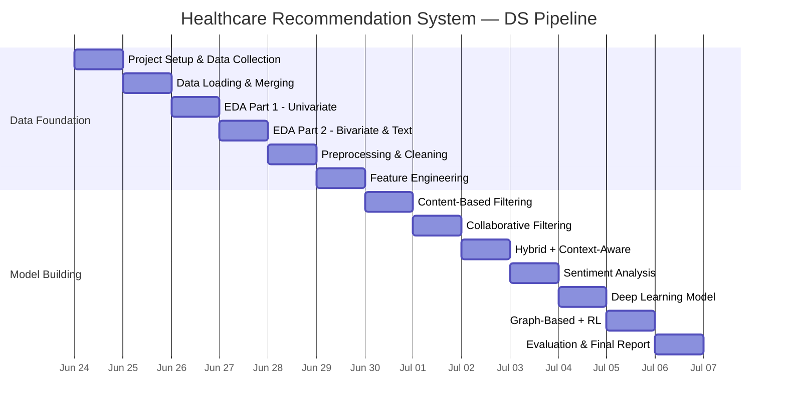

---

## 7. Evaluation Metrics — How We Measure Success

| Metric | What It Measures | Target | Used For |
|--------|-----------------|--------|----------|
| **RMSE** | Root Mean Square Error of predicted vs actual ratings | < 1.0 | Collaborative filtering |
| **MAE** | Mean Absolute Error of predictions | < 0.8 | Collaborative filtering |
| **Precision@K** | % of top-K recommendations that are relevant | > 0.6 | Content-based, Hybrid |
| **Recall@K** | % of relevant items that appear in top-K | > 0.4 | All models |
| **NDCG** | Quality of ranking (top items should be most relevant) | > 0.7 | All models |
| **Coverage** | % of total items that can be recommended | > 70% | System diversity |
| **F1-Score** | Harmonic mean of precision and recall | > 0.5 | Overall model quality |

---

## 8. Project File Structure

```
Health Recom/
│
├── 📂 data/
│   ├── 📂 raw/                          ← Original downloaded datasets
│   │   ├── symptoms_disease.csv         ← Kaggle: symptom-disease mapping
│   │   ├── disease_description.csv      ← Kaggle: disease descriptions
│   │   ├── disease_precaution.csv       ← Kaggle: precautions
│   │   ├── disease_medication.csv       ← Kaggle: medications, diet, exercise
│   │   ├── synthetic_users.csv          ← Generated: user profiles
│   │   ├── synthetic_interactions.csv   ← Generated: clicks, searches
│   │   └── synthetic_reviews.csv        ← Generated: review text + ratings
│   │
│   └── 📂 processed/                    ← Cleaned & engineered data
│       ├── unified_healthcare_data.csv
│       ├── user_item_matrix.csv
│       └── tfidf_vectors.pkl
│
├── 📂 notebooks/                        ← Jupyter notebooks (main work)
│   ├── 01_data_collection_and_loading.ipynb
│   ├── 02_exploratory_data_analysis.ipynb
│   ├── 03_data_preprocessing.ipynb
│   ├── 04_content_based_filtering.ipynb
│   ├── 05_collaborative_filtering.ipynb
│   ├── 06_hybrid_filtering.ipynb
│   ├── 07_context_aware_recommendations.ipynb
│   ├── 08_sentiment_analysis.ipynb
│   ├── 09_deep_learning_model.ipynb
│   ├── 10_graph_based_recommendation.ipynb
│   ├── 11_reinforcement_learning.ipynb
│   └── 12_model_evaluation_comparison.ipynb
│
├── 📂 src/                              ← Reusable Python modules
│   ├── data_loader.py
│   ├── preprocessing.py
│   ├── recommenders/
│   │   ├── content_based.py
│   │   ├── collaborative.py
│   │   ├── hybrid.py
│   │   ├── deep_learning.py
│   │   └── graph_based.py
│   └── evaluation.py
│
├── 📂 models/                           ← Saved trained models (.pkl, .h5)
├── 📂 reports/                          ← Analysis reports & figures
│   └── model_comparison_report.md
│
├── requirements.txt                     ← All Python dependencies
└── README.md                            ← Project overview
```

---

## 9. Key Terminology Glossary

| Term | Meaning |
|------|---------|
| **TF-IDF** | Term Frequency–Inverse Document Frequency; converts text to numerical vectors based on word importance |
| **Cosine Similarity** | Measures similarity between two vectors by calculating the cosine of the angle between them |
| **SVD** | Singular Value Decomposition; decomposes a matrix into latent factors to discover hidden patterns |
| **Embedding** | A dense, low-dimensional vector representation of a high-dimensional entity (user, item, word) |
| **Cold Start** | Problem when a new user/item has no interaction history for recommendations |
| **Collaborative Filtering** | Recommends based on what similar users liked |
| **Content-Based Filtering** | Recommends based on item features similar to what user already liked |
| **Hybrid Filtering** | Combines multiple recommendation strategies |
| **NDCG** | Normalized Discounted Cumulative Gain; measures ranking quality |
| **Knowledge Graph** | A network of entities and relationships used to model domain knowledge |
| **Multi-Armed Bandit** | A reinforcement learning strategy that balances exploring new options vs. exploiting known good ones |
| **Sentiment Analysis** | NLP technique to determine if text expresses positive, negative, or neutral opinion |
| **CRISP-DM** | Cross-Industry Standard Process for Data Mining; a standard DS workflow methodology |

---

> [!TIP]
> **How to read this document:** Start with the **Timeline (Section 6)** to understand the daily plan, then refer to **Algorithm Explanations (Section 4)** when working on each model notebook.
